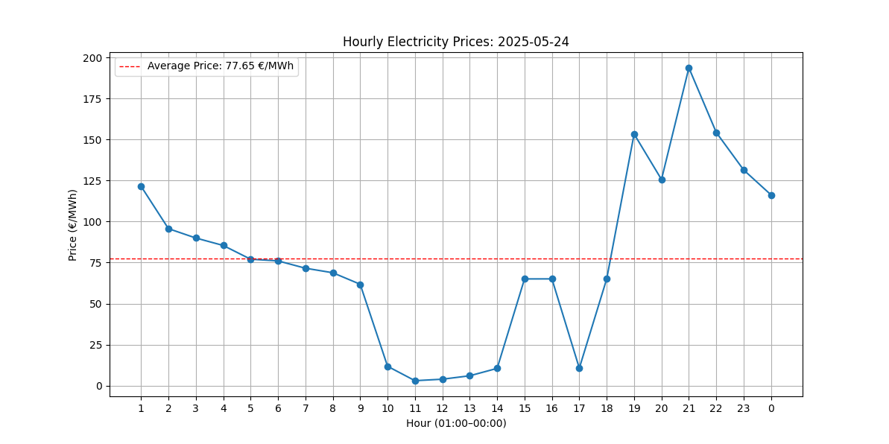

# Nord Pool Electricity Prices Scraper

Alustasin tööga, uurides Nord Pooli elektrihindade veebilehte. Kasutasin veebibrauseri "Inspect element" tööriista, et analüüsida lehe struktuuri ja tuvastada vajalikud HTML-elemendid, mida hiljem andmete kogumisel kasutada.

Töö teostamiseks valisin Python-i, kuna see on mulle tuttav ja sobib andmete kogumiseks ja töötlemiseks. Kuigi varasemalt on mul väike kokkupuude teemaga olnud, otsustasin enne töö alustamist teemasse uuesti süveneda ja uurida parimaid praktikaid.

Kasutasin järgmisi teeke:

- **Selenium** – veebilehe dünaamiliseks laadimiseks ja elementide leidmiseks
- **BeautifulSoup** – HTML-andmete töötlemiseks ja vajaliku info väljatõmbamiseks
- **Pandas** – andmete töötlemiseks ja analüüsimiseks
- **Matplotlib** – andmete visualiseerimiseks graafikuna

Järgmisena panin paika keskkonna ning tegin esimese “request”-i, et kontrollida, et kõik töötaks. Seejärel leidsin HTML-koodist elemente, mis esinevad võimalikult vähe ning asuvad andmetele võimalikult lähedal, et tagada täpne andmete kogumine.

Enda loodud koodiga laen veebilehe Seleniumiga, ootan, kuni andmetabel ilmub, ning võtan siis kogu lehe HTML-i. Seejärel kasutan BeautifulSoupi, et leida lehelt konkreetne kuupäev, mis on peidetud ühe erilise HTML-elemendi sees (`dx-date-box`).

Seejärel otsin kindla tabeli kõik read, mis sisaldavad tundide ja hindade infot. Teen hinnad numbriteks, sorteerin andmed tunnipõhiselt ja lisan kuupäeva info juurde. Pärast seda arvutan päeva keskmise hinna Pandase abil.

Lõpuks teen selle info põhjal graafiku, kus on tundide hinnad joonistatud ja näidatud ka keskmine hind. Graafik on selge ja aitab näha, kuidas hind päeva jooksul muutus.

# Mida vaja teha, et skripti automatiseerida
Olemasolev skript tuleks täiendada nii, et kogutud andmed salvestataks automaatselt andmebaasi, mis võimaldab andmete pikaajalist salvestamist. Andmebaasina võib kasutada näiteks SQL-põhist lahendust.

Lisaks oleks oluline rakendada ajastustööriistu, nagu cron Linuxi keskkonnas või Windows Task Scheduler, mis võimaldavad skripti automaatselt kindlatel aegadel päevas käivitada. See tagab andmete regulaarse ja automaatse uuendamise ilma käsitsi sekkumiseta.
